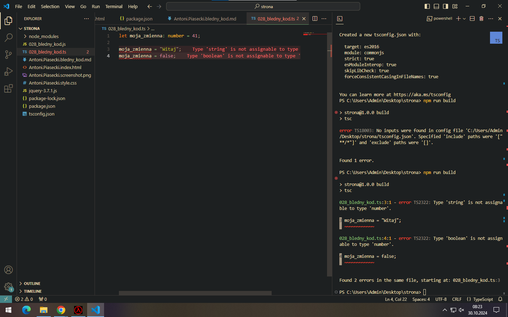

## 1. Inicjalizacja projektu npm:
```
npm init -y
```

## 2. Instalacja TypeScript:
```
npm install -g typescript
```

## 3. Inicjalizacja TypeScript:
```
npx tsc --init
```

## 4. Kompilacja:
```
npx tsc
```

## 4. Zrzuty ekranu:
